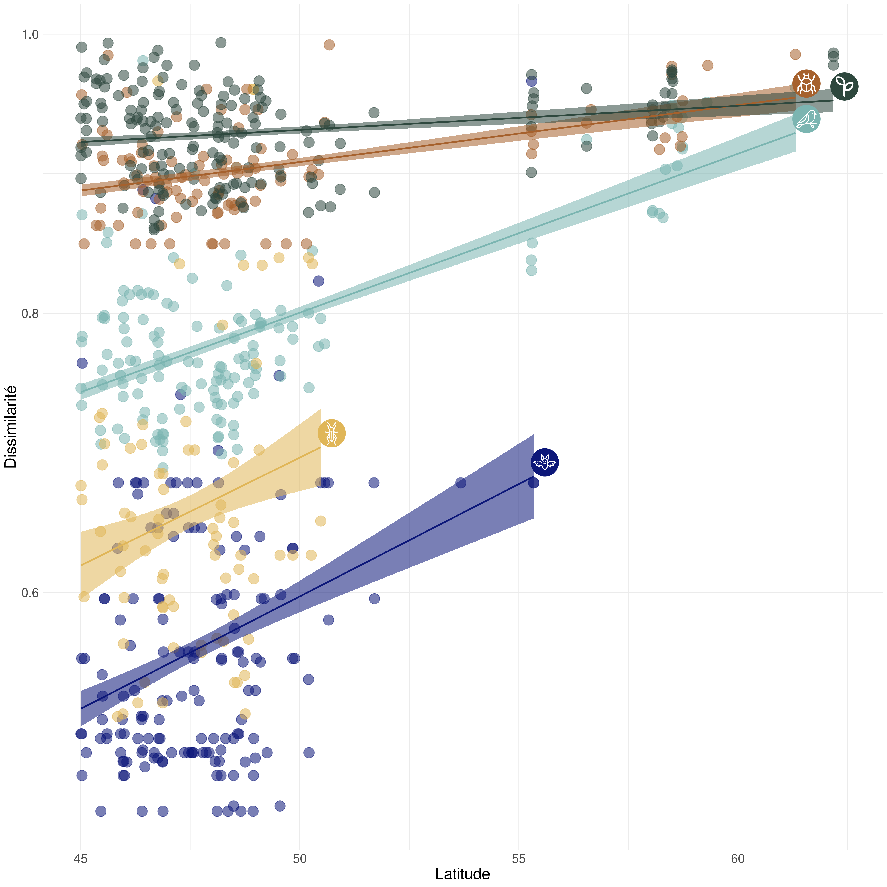
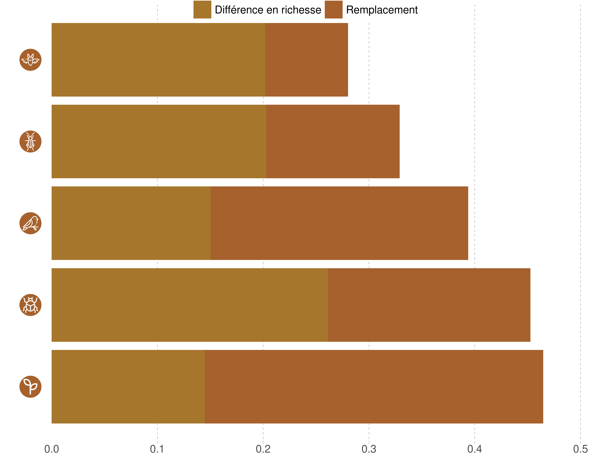
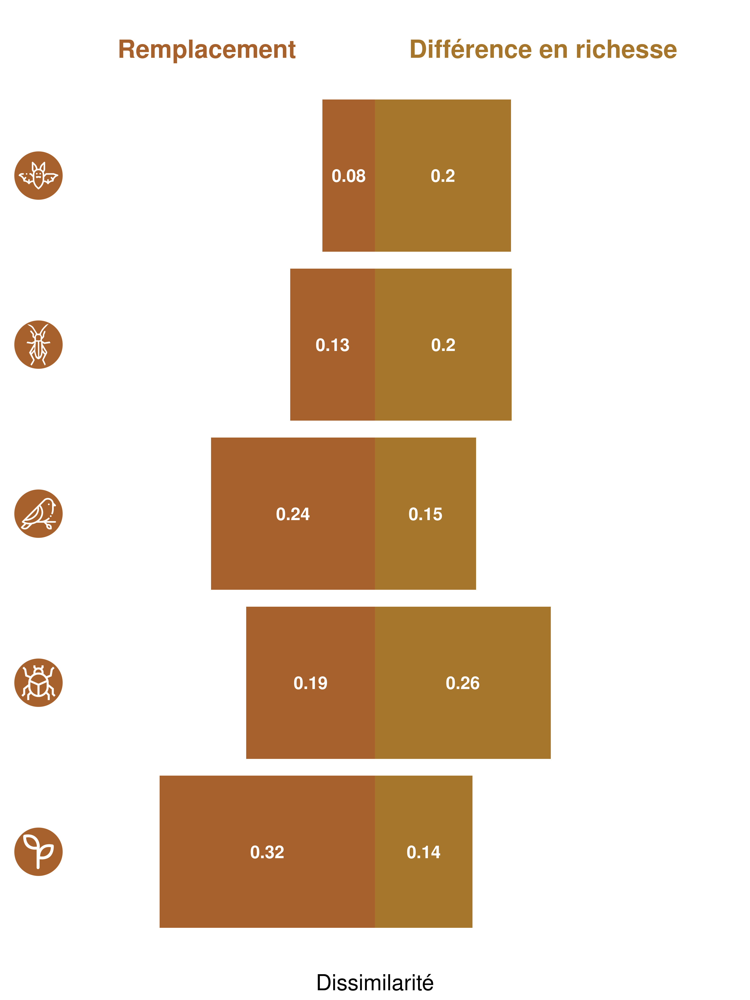

<h1>Portrait de la biodiversité</h1>

Compréhension des mécanismes affectant la dissimilarité entre les sites du Réseau de Suivi

</a>

Messages clés

<ul>
<li>
Le niveau de dissimilarité entre les sites est variable en fonction des groupes taxonomiques. 
</li>
<li>
La force des mécanismes soujacents à la dissimilarité des sites est différente selon les groupes taxonomiques.
</li>
<li>
La dissimilarité tend à augmenter avec la latitude pour tous les groupes taxonomiques étudiés 
</li>
</ul>

<h1>Mise en contexte</h1>
Afin de mieux comprendre la diversité béta associée à un groupe de sites, il est possible de définir la source de dissimilarité entre ces sites. La dissimilarité entre deux sites peut être expliquée par deux types de mécanismes: 1 - le remplacement des espèces (turnover) et 2 - la différence en richesse spécifique (nestedness qui reflète les gains et pertes en espèce)(Harrison et al. 1992; Williams 1996; Lennon et al. 2001). Le **remplacement des espèces** est associé à un gain et une perte simultanés d'espèces en réponse à un filtre environnemental, à des interactions interspecifique telle que la compétition ou à des évènements historiques (Leprieur et al 2011). La **différence en richesse spécifique** peut être associée à la diversité de niches écologiques disponibles (si plus grande diversité de niches, richesse spécifique plus grande) mais aussi à une réduction du nombre d'espèces de façon imbriquée (nestedness). Le nestedness est caractérisé par le fait que les espèces présentes à un site représentent un subset du site avec lequel on fait la comparaison (et qui présente une plus grande richesse)(Atmar & Patterson 1993; Baselga 2012). L'objectif de cette étude est de comprendre quel est le processus dominant pour expliquer la dissimilarité des sites par groupe taxonomique.

<h1>Méthode</h1>
L'analyse utilise les données du Réseau de Suivi de la Biodiversité du Québec. Il s'agit des données d'occurrences de 5 groupes taxonomiques(oiseaux, chiroptères, orthoptères, insectes du sol et végétations incluant les lichens), tout habitat confondu. Il s'agit alors de calculer l'indice de dissimilarité de Jaccard par paire de sites. Cet indice de dissimilarité est ensuite décomposé entre les indices de remplacement des espèces et de différence en richesse spécifique (Legendre 2014). 

<h1>Résultats</h1>

<h1>Discussion</h1>
Perspectives = Quels facteurs environnementaux peuvent expliquer la différence en richesse spécifique et le remplacement par groupe taxonomique par habitat ? avec utilisation des generalized dissimilarity models (Mokany et al 2022) pour étudier les liens entre la dissimilarité et les facteurs spatiaux, environnementaux et temporels. Ou une analyse de redondance peut ensuite être utilisée pour expliquer les liens écologiques.

<h1>Lexique</h1>
<ul>
<il>Diversité béta</il>
</ul>

<h1>Références</h1>
Harrison, S., Ross, S.J. & Lawton, J.H. (1992) Beta-diversity on geographic gradients in Britain. Journal of Animal Ecology, 61, 151–158.

Legendre, P. (2014) Interpreting the replacement and richness difference components of beta diversity. Global Ecology and Biogeography, 23, 1324-1334.

Lennon, J.J., Koleff, P., Greenwood, J.J.D. & Gaston, K.J. (2001) The geographical structure of British bird distributions: diversity, spatial turnover and scale. Journal of Animal Ecology, 70, 966–979.

Leprieur, F., Tedesco, P.A., Hugueny, B., Beauchard, O., Dürr, H.H., Brosse, S. & Oberdorff, T. (2011) Partitioning global patterns of freshwater fish beta diversity reveals contrasting signatures of past climate changes. Ecology Letters, 14, 325334.

Mokany, K., Ware, C., Woolley, S. N., Ferrier, S., & Fitzpatrick, M. C. (2022). A working guide to harnessing generalized dissimilarity modelling for biodiversity analysis and conservation assessment. Global Ecology and Biogeography, 31(4), 802-821.

Williams, P.H. (1996) Mapping variations in the strength and breadth of biogeographic tra nsition zones using species turnover. Proceedings of the Royal Society B: Biological Sciences, 263, 579–588.

<h1>Extra</h1>

