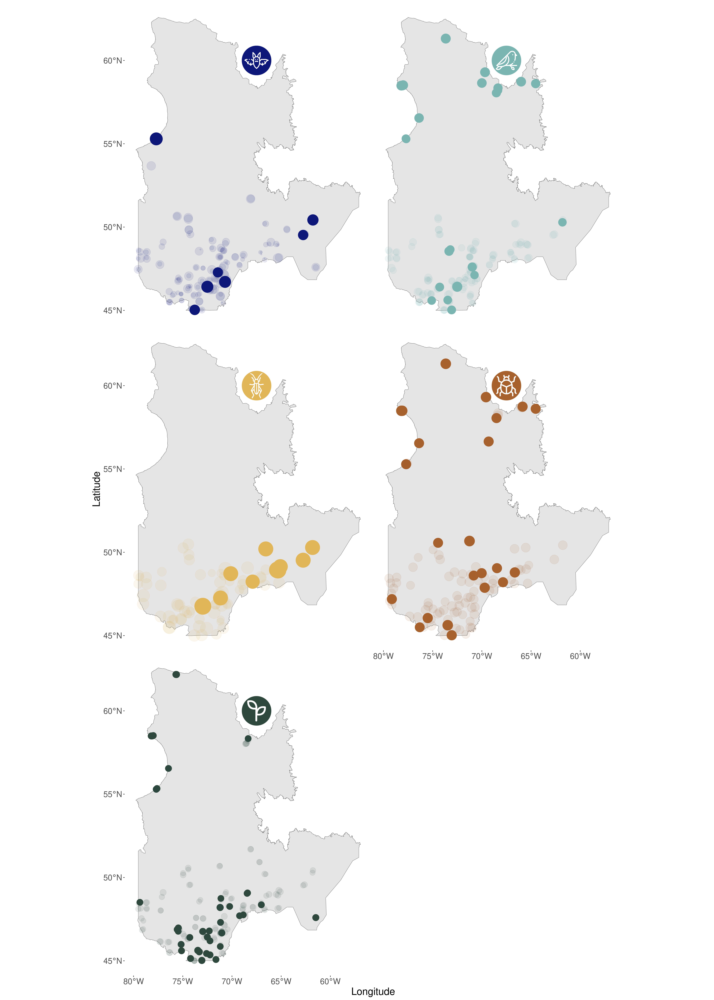
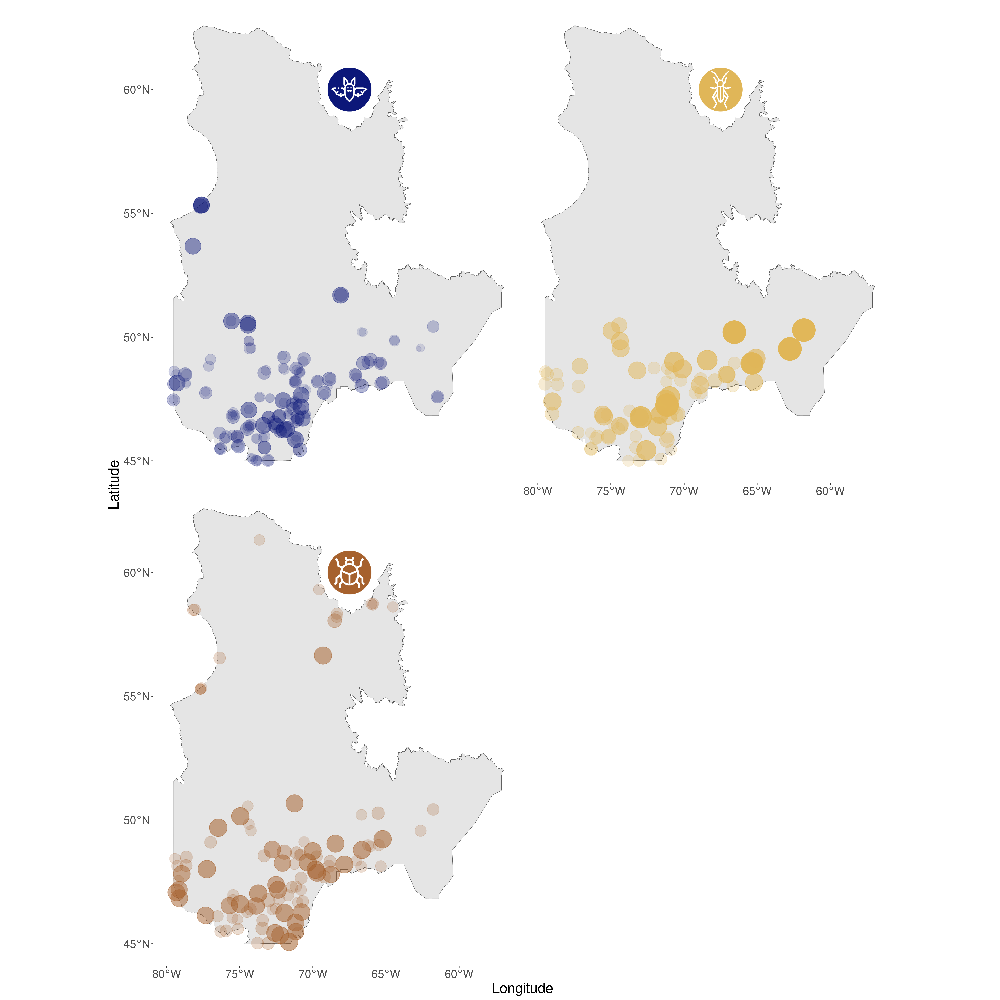
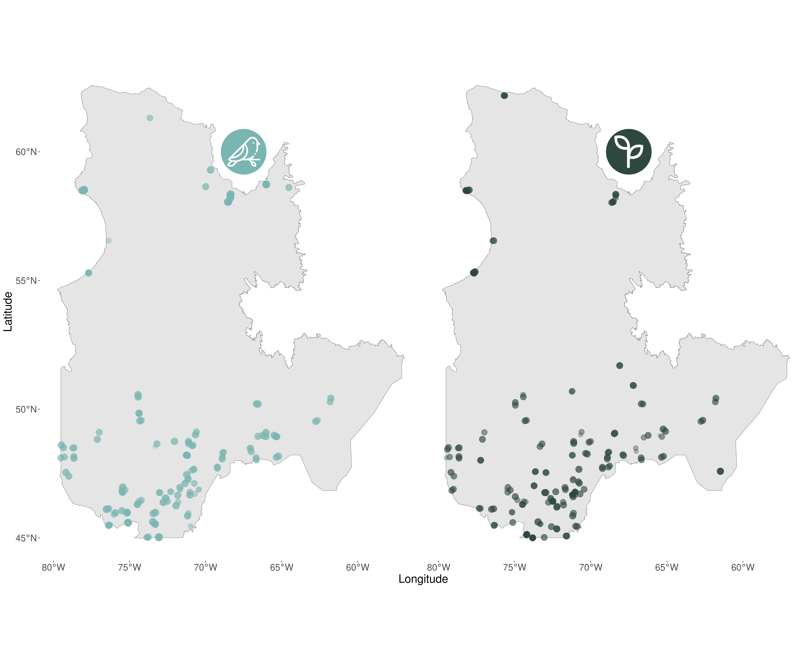

<h1>Portrait de la biodiversité</h1>

Compréhension des mécanismes affectant la dissimilarité entre les sites du Réseau de Suivi

</a>

Messages clés

<ul>
<li>
Le niveau de dissimilarité entre les sites est variable en fonction des groupes taxonomiques. 
</li>
<li>
La force des mécanismes soujacents à la dissimilarité des sites est différente selon les groupes taxonomiques.
</li>
<li>
Certains sites semblent présenter une contribution particulière quant à la différence en richesse spécifique pour les chiroptères, orthoptères et les insectes su sol.
</li>
</ul>

<h1>Biodiversité et originalité des sites</h1>
La diversité béta est un indice couramment utilisé pour caractériser la biodiversité. Cet indice permet de comparer la composition des communautés entre sites le long d’un gradient spatial et d’établir à quel point les sites sont différents (originaux) les uns des autres. La cause de la dissimilarité entre des sites peut être expliquée par deux types de processus: le remplacement des espèces (turnover) et la différence en richesse spécifique (Harrison et al. 1992; Williams 1996; Lennon et al. 2001). Le remplacement des espèces est associé à un gain et une perte simultanés d'espèces en réponse à un filtre environnemental, à des interactions interspecifiques ou à des évènements historiques (Leprieur et al 2011). La différence en richesse spécifique est caractérisée par le fait que les espèces présentes à un site représentent un sous-échantillonnage du site avec lequel on fait la comparaison (Atmar & Patterson 1993; Baselga 2012). Cette différence peut être associée à la diversité de niches écologiques disponibles dans un site par rapport à un autre. En effet, si un site présente une plus grande diversité de niches, on s’attend à observer une richesse spécifique plus importante. Les objectifs de cette étude sont (1) de caractériser le niveau de dissimilarité entre les sites étudiés par le Réseau de Suivi du Québec et d’identifier le mécanisme dominant responsable de cette dissimilarité. Puis (2) de voir s’il existe un lien entre les dissimilarités des sites au sein d’un groupe taxonomique et la latitude. 

<h1>Réseau de Suivi et ... </h1>
On s’est intéressé à la dissimilarité entre les sites pour cinq groupes taxonomiques en particulier: la végétation, les insectes du sol, les orthoptères, les chiroptères et les oiseaux. L'indice de dissimilarité de Jaccard par paire de sites est calculé pour chacun de ces groupes. Cet indice est borné entre 0 et 1, 0 signifiant que deux sites sont similaires et 1, totalement différents en termes de composition des communautés. Cet indice de dissimilarité est ensuite décomposé en deux autres indices: le remplacement des espèces et la différence en richesse spécifique (Legendre 2014). Calcul du LCBDrichness & LCBDreplacement 

La végétation et les insectes du sol sont les deux groupes taxonomiques présentant la plus grande dissimilarité entre leurs sites (0.46 & 0.45). À l’inverse, le groupe des chiroptères présente une certaine homogénéité au sein des sites inventoriés. 

 

La diversité béta (des sites) où ont été inventoriés les oiseaux et la végétation est principalement influencée par le remplacement des espèces (fig 1). La quasi-totalité des sites semblent contribuer de manière équivalente à ce mécanisme (fig 2). La diversité béta des chiroptères, orthoptères et des insectes du sol, quant à elle, est dominée par la différence en espèces entre les sites (fig 1). Pour ces trois groupes taxonomiques, plusieurs sites présentent une contribution élevée à ce mécanisme, ce qui se traduire par la présence d’espèces originales/exceptionnelles dans ces sites.  

 

Perspectives = Quels facteurs environnementaux peuvent expliquer la différence en richesse spécifique et le remplacement par groupe taxonomique? avec utilisation des generalized dissimilarity models (Mokany et al 2022) pour étudier les liens entre la dissimilarité et les facteurs spatiaux, environnementaux et temporels. Ou une analyse de redondance peut ensuite être utilisée pour expliquer les liens écologiques.Voir aussi Generalized dissimilarity modelling (GDM, Ferrier et al., 2007) 

<h1>Dissimilarité et conservation ou dissimilarité et originalité </h1>
- Gestion différente pour les groupes drivés par le remplacement vs. La différence en richesse spécifique 
- Peut-on considérer que l’originalité d’un site risque d’être davantage prépondérante pour les groupes taxonomiques drivés par le remplacement des espèces 

<h1>Figures</h1>

  
**Figure 1** : Dissimilarité totale entre les sites inventoriés par le Réseau de Suivi de la Biodiversité du Québec pour 5 groupes taxonomiques (du haut vers le bas) : chiroptères, orthoptères, oiseaux, insectes du sol et végétation. Ce graphique présente la valeur de dissimilarité totale par groupe taxonomique (marron) et dans quelles proportions cette dissimilarité est expliquée par le remplacement des espèces (orange) et la différence en richesse spécifique (jaune) entre les sites.   

  
**Figure 2** : Valeurs de contribution locale à la diversité béta (LCBD) par sites par groupe taxonomique (bleu : chiroptères, cyan : oiseaux, jaune : orthoptères, marron : insectes du sol, vert : végétation). La taille des cercles correspond à la valeur de LCBD. La couleur pleine indique que la valeur du LCBD est significativement différente de 0 (basé sur les valeurs de p.value non ajustées pour des tests multiples).

  
**Figure 3** : Valeur de la contribution locale à l’indice de différence de richesse spécifique pour les chiroptères, les orthoptères et les insectes du sol. La taille des points est proportionnelle à la valeur de l’indice. Pour chaque groupe taxonomique, certains sites semblent contribuer de façon plus importante à la différence en richesse spécifique (point les plus gros; significativité de LCBD non testable à cause de la méthode de calcul).

  
**Figure 4** : Valeur de la contribution locale à l’indice de remplacement des espèces pour les oiseaux et la végétation. La taille des points est proportionnelle à la valeur de l’indice. Pour chaque groupe taxonomique, les sites présentent une certaine homogénéité en termes de contribution au remplacement des espèces (point de taille équivalente; significativité de LCBD non testable à cause de la méthode de calcul). 

<h1>Lexique</h1>
<ul>
<il>Diversité béta</il>
</ul>

<h1>Références</h1>
Harrison, S., Ross, S.J. & Lawton, J.H. (1992) Beta-diversity on geographic gradients in Britain. Journal of Animal Ecology, 61, 151–158.

Legendre, P. (2014) Interpreting the replacement and richness difference components of beta diversity. Global Ecology and Biogeography, 23, 1324-1334.

Lennon, J.J., Koleff, P., Greenwood, J.J.D. & Gaston, K.J. (2001) The geographical structure of British bird distributions: diversity, spatial turnover and scale. Journal of Animal Ecology, 70, 966–979.

Leprieur, F., Tedesco, P.A., Hugueny, B., Beauchard, O., Dürr, H.H., Brosse, S. & Oberdorff, T. (2011) Partitioning global patterns of freshwater fish beta diversity reveals contrasting signatures of past climate changes. Ecology Letters, 14, 325334.

Mokany, K., Ware, C., Woolley, S. N., Ferrier, S., & Fitzpatrick, M. C. (2022). A working guide to harnessing generalized dissimilarity modelling for biodiversity analysis and conservation assessment. Global Ecology and Biogeography, 31(4), 802-821.

Williams, P.H. (1996) Mapping variations in the strength and breadth of biogeographic tra nsition zones using species turnover. Proceedings of the Royal Society B: Biological Sciences, 263, 579–588.
